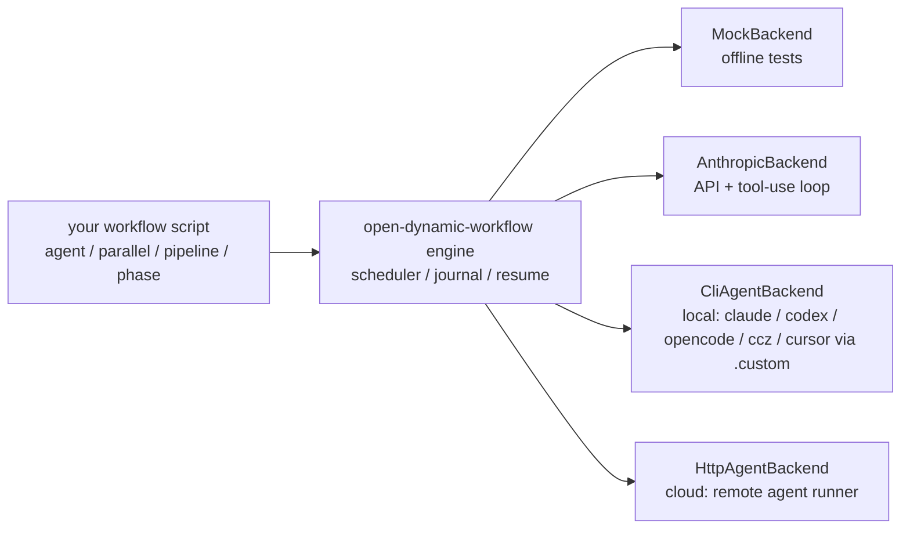

# open-dynamic-workflow

[](https://github.com/robotlearning123/open-dynamic-workflow/actions/workflows/ci.yml)
[](./tools/compare.mjs)
[](./LICENSE)

> **Capability first:** a dynamic-workflow runtime *as capable as Claude Code's* — a verified **1:1** reproduction of [Claude Code's dynamic workflows](https://claude.com/blog/introducing-dynamic-workflows-in-claude-code), then taken further: your **basic unit is any agent** (Claude Code, Codex, OpenCode, Cursor, local workers…), running **local or in the cloud**.

Claude writes orchestration scripts that fan out tens–hundreds of parallel subagents and check their own work. This repo reproduces that engine **outside** Claude Code — and was reverse-engineered the honest way: we **ran the real thing 7 times, captured its logs, and matched the observed behavior** until a differential gate scores 100%.

```
 blog (concepts)  +  REAL working logs (traces/, 7 runs)  ──▶  ANALYSIS.md  ──▶  src/  ──▶  compare.mjs = 34/34 (100%)
        S1                       S2–S5                          reasoning       engine        OURS vs CLAUDE
```

## Why this exists — capability first
1. **As capable as raw.** Orchestration is **1:1** (full primitive set, asserted **34/34** in CI) and the basic unit can *be* the strongest real agent — `CliAgentBackend.claude()/codex()/opencode()` spawn the actual agents, so a subagent is exactly as powerful as raw's. A mixed fleet (Claude + Codex + OpenCode + cloud) is **more** capable than raw's Claude-only fleet. **Live-verified** (not just mock): `node tools/live-e2e.mjs` drove 2 real `claude -p` agents in parallel through the engine → `["ALPHA","BETA"]` (evidence in `traces/e2e-live/`).
2. **Covers all of raw.** primitives, schema output, journal/resume, concurrency cap, budget, nesting, sandbox, worktree isolation — honest matrix in [`PARITY.md`](./docs/PARITY.md).
3. **Then more (the bonus).** Local→cloud, multi-vendor, deterministic offline testing, cross-session resume, open (MIT) — things the closed, Claude-only, in-session engine can't do.

## The basic unit is an *agent* (pluggable, local → cloud)

| backend | the agent unit | use |
|---|---|---|
| `MockBackend` | synthesized (schema-faking, deterministic) | offline tests, the fidelity gate |
| `AnthropicBackend` | a Claude API call **+ optional tool-use loop** | direct API, tools |
| `CliAgentBackend` | a **real local agent process** presets `.claude()` / `.codex()` / `.opencode()` / `.worker('ccz')` / `.custom()` | local fleets — the agent brings its own tools |
| `HttpAgentBackend` | a **remote agent** over HTTP | cloud: OpenAI Responses · Vertex Agent Engine · Bedrock · Claude Managed Agents (adapter) |

```js
import { runWorkflowFile, CliAgentBackend, HttpAgentBackend, AnthropicBackend, MockBackend } from "open-dynamic-workflow";

// local real agents (each agent() spawns a full Claude Code agent):
await runWorkflowFile("examples/research.js", { backend: CliAgentBackend.claude({ model: "sonnet" }) });
// a fleet of free local workers:
await runWorkflowFile("examples/research.js", { backend: CliAgentBackend.worker("ccz") });
// move the unit to the cloud — same orchestration:
await runWorkflowFile("examples/research.js", { backend: new HttpAgentBackend({ url: "https://your-runner/agent" }) });
```

## Quick start
```bash
# Requires Node.js >= 20
npm install && npm run build
npm test                              # 239 tests
npm run compare                       # OURS vs CLAUDE → 34/34 = 100%
node dist/cli.js examples/review-changes.js --mock   # offline, deterministic
```

## What testing the real thing revealed (not in the docs)
1. **Resume is 100% cache-hit only for *sequential* scripts.** The cache key is **prefix-chained** (experiment-06: editing 1 of 4 *independent* agents changed the *later* agents' keys too), so an edit — or a `parallel`/`pipeline` completion-order reorder — cascades to every later call. (`traces/experiment-06/FINDING-resume-model.md`)
2. **`parallel` crashes on a *synchronous* thunk throw** — only async rejections become `null`.
3. The subagent is a **full Claude Code agent** (one probe shelled out via `Bash` + filesystem MCP before answering) — which is exactly why our basic unit is a real agent, not a bare LLM call.
4. **Concurrency cap = `min(16, cores-2)`**; **budget** is a turn-global output-token meter (turn-global in raw; run-scoped in this engine — see Honest boundaries).

**Full teardown (blog):** [`docs/blog/2026-05-28-reverse-engineering-claude-dynamic-workflows.md`](./docs/blog/2026-05-28-reverse-engineering-claude-dynamic-workflows.md). Cited write-up: [`ANALYSIS.md`](./ANALYSIS.md). How it was built: [`RUNLOG.md`](./RUNLOG.md). Sources: [`PROVENANCE.md`](./PROVENANCE.md).

## Primitives
`agent(prompt, opts?)` · `parallel(thunks)` · `pipeline(items, ...stages)` · `phase(t)` · `log(m)` · `budget` · `workflow(ref, args?)` — plain-JS scripts in a `vm` sandbox, journaled for resume. Mapping table in [`SPEC.md`](./SPEC.md).

## Repo layout
```
ANALYSIS.md RUNLOG.md SPEC.md PROVENANCE.md docs/PARITY.md docs/goals/
traces/   7 real runs (raw journal + per-subagent transcripts) + harvested digests + probe scripts
tools/    harvest_trace.py · compare.mjs (1:1 gate) · crosscheck.mjs
src/      engine + 4 backends   test/  238 vitest tests   examples/  plain-JS workflows
```

## Honest boundaries
We reproduce **observable behavior**, not Claude Code's internals: the `v2:` hash preimage is undisclosed (we match shape/semantics), `budget` is run-scoped here vs turn-global in the harness, CLI agents' tokens are estimated, and the script API names are the **observed in-product API** (execution-verified via `traces/`), not public-doc-published. Per official docs, resume is **same-session-only** — our journal-based **cross-session** replay is a superset. With `CliAgentBackend.claude()` the unit literally *is* Claude Code. **Security:** the `vm` runtime reproduces the API shape, not a boundary — run only **trusted** workflow source ([`SECURITY.md`](./SECURITY.md)). Full landscape (vs raw + LangGraph/CrewAI/AutoGen/Mastra/claude-flow + managed-agent platforms): [`docs/COMPARISON.md`](./docs/COMPARISON.md). See `PARITY.md` §3–4 for the roadmap to "strictly better."

## License
MIT. "Claude"/"Claude Code" are Anthropic's; this is an independent educational reproduction.
